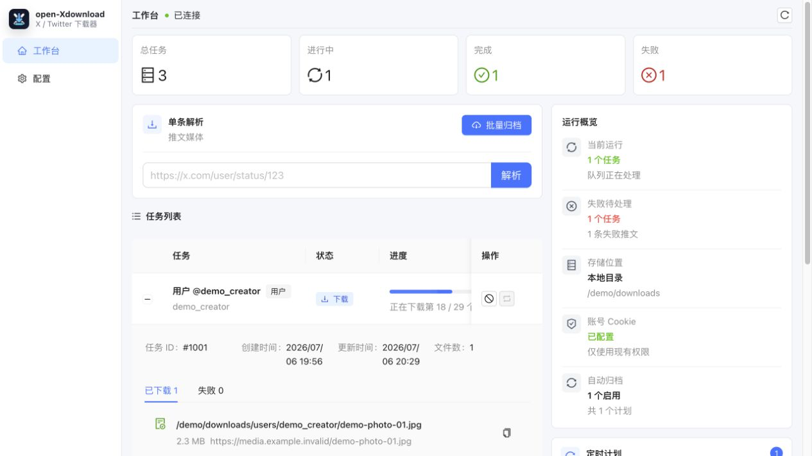
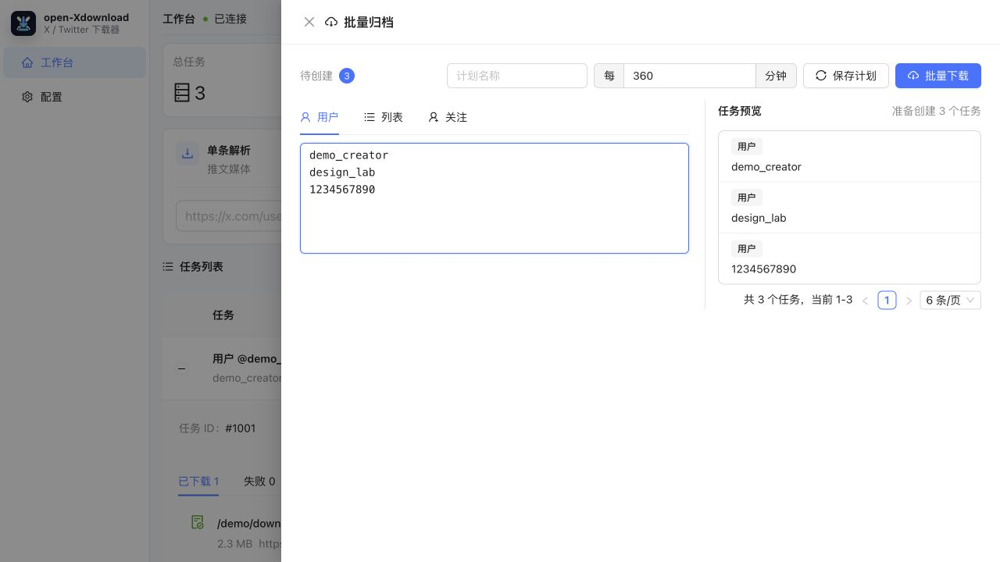

# open-Xdownload

<p align="center">
  
</p>

open-Xdownload 是一个本地优先的 X / Twitter 下载器。它提供内置 Web 界面、后台任务队列和 SQLite 本地数据库，适合把单条推文、指定用户、列表成员或某个账号的关注对象中的媒体文件下载并归档到本地目录、SMB 共享或 WebDAV。

## 功能概览

- 单条推文解析与下载：输入 `x.com` 或 `twitter.com` 推文链接，解析正文、作者和媒体列表，下载图片、视频、GIF 的最佳可用版本。
- 用户媒体归档：按用户名、`@用户名` 或用户 ID 归档该用户媒体时间线中的推文媒体。
- 列表归档：输入 X 列表 ID，自动获取列表成员并归档成员发布的媒体。
- 关注归档：输入某个账号，自动获取它关注的账号并归档这些账号发布的媒体。
- 批量任务：用户、列表、关注目标可以一次输入多行，单次最多创建 200 个任务，并会自动去重。
- 定时计划：可把用户、列表、关注目标保存为自动归档计划，支持启用、停用、立即运行和删除。
- 增量同步：记录每个用户目录的最新媒体发布时间，后续归档只拉取新增内容；已下载过的媒体会跳过。
- 工作台任务列表：任务状态、进度、错误信息和下载记录直接在工作台展示，支持取消任务、重新执行、复制文件路径或失败媒体地址。
- 失败重试：批量归档中失败的推文会进入失败队列，可手动全部重试，也可开启任务结束后的自动重试。
- Cookie 池：支持主 Cookie 和多组备用 Cookie，用于列表、用户、关注归档以及 API 限流轮换。
- 多存储后端：支持本地目录、SMB 共享和 WebDAV。

## 任务类型

| 类型 | 输入示例 | 是否需要 X Cookie | 说明 |
| --- | --- | --- | --- |
| 单条推文 | `https://x.com/user/status/1234567890` | 否 | 解析并下载单条推文中的媒体。 |
| 用户 | `openai`、`@openai`、`44196397` | 是 | 归档指定用户媒体时间线中的媒体。 |
| 列表 | `1234567890` | 是 | 获取列表成员，并归档成员发布的媒体。 |
| 关注 | `openai`、`@openai`、`44196397` | 是 | 获取目标账号关注的用户，并归档这些用户发布的媒体。 |

## 界面预览

以下截图使用演示数据生成，不包含真实账号、Cookie、下载路径或任务记录。





## Docker Compose 部署

推荐用 Docker Compose 运行。新建 `compose.yml`：

```yaml
services:
  open-xdownload:
    image: ghcr.io/chenbin3625/open-xdownload:latest
    container_name: open-xdownload
    restart: unless-stopped
    ports:
      - "127.0.0.1:8787:8787"
    environment:
      OPEN_XDOWNLOAD_ADDR: 0.0.0.0:8787
      OPEN_XDOWNLOAD_DATA_DIR: /data
      OPEN_XDOWNLOAD_DOWNLOAD_DIR: /downloads
      TZ: Asia/Shanghai
    volumes:
      - ./data:/data
      - ./downloads:/downloads
```

启动：

```bash
docker compose up -d
```

访问：

```text
http://127.0.0.1:8787
```

升级镜像：

```bash
docker compose pull
docker compose up -d
```

停止服务：

```bash
docker compose down
```

## Docker 运行

也可以直接使用 `docker run`：

```bash
docker run -d \
  --name open-xdownload \
  --restart unless-stopped \
  -p 127.0.0.1:8787:8787 \
  -e OPEN_XDOWNLOAD_ADDR=0.0.0.0:8787 \
  -e OPEN_XDOWNLOAD_DATA_DIR=/data \
  -e OPEN_XDOWNLOAD_DOWNLOAD_DIR=/downloads \
  -e TZ=Asia/Shanghai \
  -v "$PWD/data:/data" \
  -v "$PWD/downloads:/downloads" \
  ghcr.io/chenbin3625/open-xdownload:latest
```

## 二进制运行

从 Release 下载对应系统的 `open-xdownload` 后运行：

```bash
./open-xdownload
```

默认监听 `127.0.0.1:8787`，数据目录为当前目录下的 `data`，下载目录为当前目录下的 `downloads`。

如需指定路径：

```bash
OPEN_XDOWNLOAD_DATA_DIR=/path/to/data \
OPEN_XDOWNLOAD_DOWNLOAD_DIR=/path/to/downloads \
./open-xdownload -addr 127.0.0.1:8787
```

可用服务参数：

| 参数 | 环境变量 | 默认值 | 说明 |
| --- | --- | --- | --- |
| `-addr` | `OPEN_XDOWNLOAD_ADDR` | `127.0.0.1:8787` | HTTP 监听地址。Docker 内需要使用 `0.0.0.0:8787` 才能通过端口映射访问。 |
| `-data-dir` | `OPEN_XDOWNLOAD_DATA_DIR` | `data` | SQLite 数据库目录，数据库文件为 `open-xdownload.db`。 |
| `-web-dir` | `OPEN_XDOWNLOAD_WEB_DIR` | `apps/web/dist` | 前端静态文件目录；目录不存在时使用二进制内置的 Web UI。 |
| 无 | `OPEN_XDOWNLOAD_DOWNLOAD_DIR` | 当前目录下的 `downloads` | 首次生成配置时使用的默认下载目录。 |

## 首次配置

启动服务并打开 Web UI 后，进入“配置”页面：

1. 选择存储方式。
2. 如果使用本地目录，确认下载目录；Docker 部署时通常保持 `/downloads`。
3. 如果使用 SMB，填写主机、端口、共享名、目录、域、用户名和密码。
4. 如果使用 WebDAV，填写服务地址、目录、用户名和密码。
5. 如访问 X 或下载媒体需要代理，填写代理地址，例如 `http://127.0.0.1:7890`。
6. 设置最大并发、文件命名方式和最大文件名长度。
7. 如需用户、列表、关注归档，填写 X Cookie：`auth_token` 和 `ct0`。
8. 如有多个账号 Cookie，在“备用 Cookie”中按组填写，用于批量归档时轮换。
9. 点击“保存配置”，再点击“校验登录”确认 Cookie 可用。

敏感字段读取时会显示为 `********`。再次保存配置时，留空或保持 `********` 不会覆盖已有密钥或密码。

## 使用教程

### 下载单条推文媒体

1. 打开“工作台”。
2. 在“单条解析”中粘贴推文链接。
3. 点击“解析”，确认识别出的媒体列表。
4. 点击“下载媒体”创建任务。
5. 在工作台的“任务列表”查看进度，完成后展开任务可复制文件路径。

单条推文解析通常不需要配置 X Cookie，但私密、删除、受限或无法公开访问的推文可能无法解析。

### 批量归档用户、列表或关注关系

1. 先在“配置”页面填写并校验 X Cookie。
2. 回到“工作台”，点击“批量归档”打开抽屉。
3. 在“用户”“列表”“关注”标签页中输入目标，每行一个。
4. 右侧确认任务预览。
5. 点击“批量下载”创建任务。

用户目标支持用户名、`@用户名` 和用户 ID；列表目标使用列表 ID；关注目标表示“归档这个账号关注的人发布的媒体”。

### 创建定时归档计划

1. 在“批量归档”抽屉中输入用户、列表或关注目标。
2. 填写计划名称。
3. 设置执行间隔，范围为 5 分钟到 43200 分钟。
4. 点击“保存计划”。
5. 在右侧“定时计划”中可启用、停用、立即运行或删除。

定时计划只支持用户、列表和关注目标，不支持单条推文链接。每个计划最多包含 200 个目标。如果上次计划创建的任务仍在运行，下一次执行会顺延。

### 处理失败任务

- 单个任务失败后，可在工作台“任务列表”点击“重新执行”。
- 运行中的任务可点击“取消”。
- 批量归档中下载失败的推文会进入“失败推文队列”。
- 可在失败队列中点击“全部重试”，也可删除单条失败记录或清空队列。
- 配置中的“失败重试”开启后，批量归档任务结束时会自动尝试重试失败队列。

## 存储和文件目录

本地存储默认目录结构：

```text
downloads/
  users/
    用户名或昵称/
      媒体文件
  lists/
    列表名(列表ID)/
      指向用户目录的链接
```

说明：

- 用户归档和关注归档会把媒体保存到 `users/用户名或昵称/`。
- 列表归档会创建 `lists/列表名(列表ID)/`，其中包含指向用户目录的链接，避免同一用户媒体被复制多份。
- SMB 和 WebDAV 使用相同的逻辑路径，但不会创建本地符号链接。
- 文件名会清理系统不支持的字符，并受“最大文件名长度”限制。
- 图片会尽量下载大图版本，视频和 GIF 会选择最高码率 MP4。

## 配置项说明

| 配置项 | 说明 |
| --- | --- |
| 存储类型 | 可选本地目录、SMB、WebDAV。 |
| 下载目录 | 本地存储根目录。Docker 部署时建议映射到宿主机目录。 |
| 代理 | 用于 X API 请求和媒体下载。留空则直连。 |
| 并发 | 后台任务最大并发数，范围 `1-64`。 |
| 文件名命名 | 可选“仅推文”或“用户名 + 用户 ID + 推文”。 |
| 最大文件名长度 | 范围 `16-240`。 |
| X Cookie | 主 `auth_token` 和 `ct0`，用于登录态接口。 |
| 备用 Cookie | 多组备用 `auth_token` / `ct0`，用于批量归档轮换。 |
| 失败重试 | 批量归档结束时自动重试失败推文队列。 |
| 保护账号自动关注 | 遇到未关注的保护账号时尝试自动关注。 |

## 数据备份

建议定期备份：

```text
data/open-xdownload.db
downloads/
```

其中 `open-xdownload.db` 保存配置、任务、下载记录、用户、列表、定时计划和失败队列；`downloads/` 保存实际媒体文件。使用 SMB 或 WebDAV 时，实际媒体文件位于对应远程存储中。

## 安全说明

open-Xdownload 面向个人本地归档场景，服务本身没有内置用户登录和访问鉴权。建议只绑定本机地址，或放在带鉴权的反向代理后面。

Docker Compose 示例中的端口映射为：

```yaml
ports:
  - "127.0.0.1:8787:8787"
```

这表示只有宿主机本机可以访问。如需暴露到局域网或公网，请先配置反向代理、访问控制和 HTTPS。

请确认你有权下载和保存相关内容，并遵守 X / Twitter 的服务条款、目标站点规则以及所在地法律法规。
